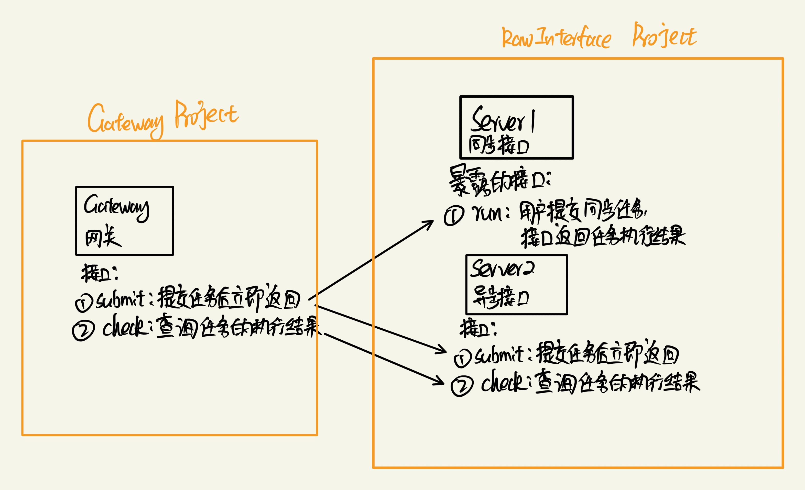

# Raw Interface（网管模拟实现的接口Mock项目）

> 网关项目见链接：[网关项目](https://github.com/shaojunying/Gateway)

## 背景

假设现有一系列接口，这些接口有些是同步的，有些是异步的，我们需要编写一个网关层，将这些江口统一暴露成异步接口。

### 架构图

## 项目内容

当前项目（RawInterface）实现的是右侧大方框圈出的部分，模拟并暴露原始的同步接口和异步接口

### 暴露API

#### 同步接口1（任务的执行状态总是成功）

- /synchronous-task/run (POST) 运行同步任务，阻塞等待任务执行完成，返回任务执行结果

#### 同步接口2（任务的执行状态总是失败）

- /asynchronous-failed-task/run (POST) 运行同步任务，阻塞等待任务执行完成，返回任务执行结果

#### 异步接口1（任务的执行状态总是成功）

- /asynchronous-task/submit (POST) 提交异步任务，立即返回
- /asynchronous-task/check (GET) 检查异步任务的执行状态，返回任务执行结果

#### 异步接口2（任务的执行状态总是失败）

- /asynchronous-failed-task/submit (POST) 提交异步任务，立即返回
- /asynchronous-failed-task/check (GET) 检查异步任务的执行状态，返回任务执行结果

### 实现

#### 同步接口

- run 接口，睡眠0-5秒之间的随机时间，然后返回任务执行结果

#### 异步接口

- submit 接口，将键值对<任务id, 任务提交时间>存入ConcurrentHashMap
- check 接口，根据任务id，从ConcurrentHashMap中获取任务提交时间，如果当前时间距离任务提交时间超过5秒，则返回成功，否则返回运行中

